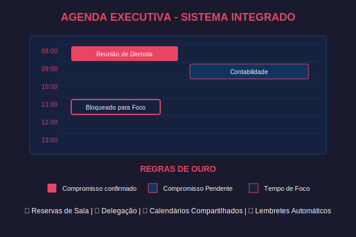
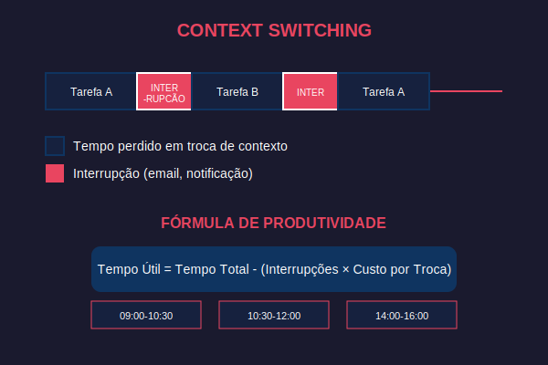

# 📁 FECOP 1: Organização Digital e Comunicação Corporativa

> **Carga Horária Estimada:** 24 Horas
> **Foco:** Agenda eletrônica, calendários, reuniões, lembretes, compartilhamento, grupos em ambientes multimídia, correio eletrônico corporativo e redes sociais profissionais.
> **Baseado nos Tópicos Oficiais do SENAI (FECOP):** Tópico 1 (subtópicos 1.1 a 1.5) e Tópico 2 (subtópicos 2.1 a 2.3).

Imagine que você acabou de ser contratado como **Assistente Administrativo** em uma grande indústria metalúrgica em Sertãozinho, SP. No primeiro dia, seu gerente pergunta: *"Você já configurou sua agenda corporativa? Preciso que organize a reunião de produção para quinta-feira, envie o convite para toda a equipe e compartilhe a pauta no grupo do Teams."* Se você travou nessa hora, esta unidade é para você.

No mundo corporativo da Indústria 4.0, a **organização digital** não é um luxo — é uma habilidade de sobrevivência. Profissionais que dominam ferramentas de agenda, e-mail e comunicação em grupo são promovidos mais rápido, erram menos e produzem mais. Vamos transformar você nesse profissional.



---

## 📝 CAPÍTULO 1: A Agenda Eletrônica como Ferramenta Estratégica (Tópico 1)

No ambiente corporativo moderno, **tempo é o recurso mais valioso**. Grandes empresas como Ambev, Vale e Embraer investem milhões em sistemas de gestão de tempo porque um minuto perdido na linha de produção pode custar milhares de reais. A agenda eletrônica é a ferramenta número um para gerenciar esse recurso.

### 1.1. Calendários Digitais (Tópico 1.1)

Um calendário digital é muito mais do que uma versão online do calendário de papel da parede. Ele é um **sistema inteligente de gestão do tempo** que sincroniza automaticamente entre todos os seus dispositivos, envia alertas, detecta conflitos de horário e permite que outras pessoas vejam sua disponibilidade.

**Principais plataformas de calendário no mercado brasileiro:**

| Plataforma | Custo | Usado em | Ideal para |
|------------|-------|----------|------------|
| **Google Agenda** | Gratuito | Pequenas empresas, freelancers | Uso pessoal e pequenos times |
| **Microsoft Outlook** | R$ 37/mês (Microsoft 365 Business) | Grandes empresas, indústrias | Ambiente corporativo integrado |
| **Apple Calendar** | Gratuito (em dispositivos Apple) | Agências, designers | Quem usa ecossistema Apple |
| **Zoho Calendar** | Gratuito até 5 usuários | Startups, PMEs | Empresas que usam Zoho Suite |

**Funcionalidades essenciais de um calendário digital:**

- **Visualização por dia, semana, mês e ano** — Permite enxergar compromissos em diferentes escalas de tempo
- **Código de cores** — Diferenciar reuniões de trabalho (azul), pessoais (verde), urgências (vermelho)
- **Fuso horário inteligente** — Essencial para empresas com filiais em outros estados ou países
- **Integração com e-mail** — Convites de reunião vão direto para o calendário

> 💡 **Você sabia?** Segundo pesquisa da Microsoft, profissionais que usam calendário digital economizam em média **2,5 horas por semana** comparado aos que usam métodos manuais de organização.

---

> ### 🖥️ Atividade Prática: Configurando seu Calendário Digital
>
> **Tempo estimado:** 10 minutos
>
> **O que fazer:**
> 1. Abra o navegador e acesse [calendar.google.com](https://calendar.google.com) (ou o Outlook se disponível)
> 2. Crie um **novo evento** chamado "Reunião de Produção — Setor B"
> 3. Configure a data para a **próxima quinta-feira, das 14h às 15h**
> 4. Adicione uma **descrição**: "Pauta: revisão dos indicadores semanais de produção"
> 5. Configure uma **cor** diferente para o evento (use vermelho para urgente)
> 6. Adicione um **lembrete** de 30 minutos antes
>
> **Resultado esperado:** Um evento colorido aparece no seu calendário com lembrete configurado.
>
> 💡 **Dica:** Se estiver usando o Google Agenda, clique no ícone de lápis para acessar as opções avançadas do evento.

---

### 1.2. Reuniões e Convites Digitais (Tópico 1.2)

No mundo corporativo, você não "marca" uma reunião — você **convoca** uma reunião digital. A diferença? Um convite digital envia automaticamente para todos os participantes, verifica conflitos de agenda, reserva sala e gera um link de videoconferência.

**Anatomia de um convite de reunião profissional:**

| Elemento | O que colocar | Exemplo |
|----------|--------------|---------|
| **Título** | Objetivo claro (não genérico) | "Revisão KPIs Produção — Maio/2026" |
| **Data/Hora** | Dia, horário de início e fim | Quinta, 14h00–15h00 |
| **Local** | Sala física ou link virtual | Sala 3B ou link do Teams/Meet |
| **Participantes** | E-mails de todos os convidados | gerente@empresa.com.br |
| **Pauta** | Tópicos que serão discutidos | 1. Meta mensal 2. Gargalos 3. Ações |
| **Anexos** | Documentos de apoio | Relatório_KPI_Maio.xlsx |

**Erros comuns em reuniões corporativas (e como evitar):**

1. ❌ **Reunião sem pauta** → Ninguém sabe o que discutir → ✅ Sempre inclua pelo menos 3 tópicos
2. ❌ **Reunião sem horário de término** → Reunião de 30 min vira 2 horas → ✅ Defina início E fim
3. ❌ **Convidar pessoas demais** → Perda de produtividade → ✅ Só convide quem decide ou executa
4. ❌ **Não enviar ata depois** → Decisões se perdem → ✅ Envie um resumo em até 24h

---

> ### 🖥️ Atividade Prática: Enviando seu Primeiro Convite de Reunião
>
> **Tempo estimado:** 8 minutos
>
> **O que fazer:**
> 1. No Google Agenda (ou Outlook), crie um novo evento
> 2. Título: **"Treinamento — Segurança do Trabalho"**
> 3. Data: próxima segunda-feira, **09h00 às 10h30**
> 4. Na seção "Convidados", adicione o e-mail do colega ao lado
> 5. Na descrição, escreva a pauta:
>    - Uso de EPIs na linha de montagem
>    - Procedimento de evacuação
>    - Dúvidas e sugestões
> 6. Clique em **"Enviar"** (o colega receberá o convite por e-mail)
>
> **Resultado esperado:** Seu colega recebe um e-mail com o convite e pode aceitar ou recusar direto na agenda dele.
>
> 💡 **Dica:** No mundo real, o gerente recebe uma notificação de quem aceitou e quem recusou — isso é o "RSVP digital".

---

### 1.3. Lembretes e Notificações Inteligentes (Tópico 1.3)

Lembretes são **alarmes contextuais** que garantem que você não esqueça compromissos, prazos e tarefas. A diferença entre um profissional organizado e um desorganizado muitas vezes é simplesmente: **o organizado configura lembretes**.

**Tipos de lembretes em ferramentas corporativas:**

| Tipo | Quando usar | Exemplo |
|------|-------------|---------|
| **Pop-up** | Compromissos imediatos | "Reunião em 15 minutos" |
| **E-mail** | Prazos importantes com antecedência | "Relatório vence amanhã" |
| **SMS/Push** | Emergências ou tarefas críticas | "Backup do servidor às 23h" |
| **Recorrente** | Tarefas que se repetem | "Todo dia 5: fechar folha de ponto" |

**Boas práticas de lembretes:**

- Configure **2 lembretes** para reuniões importantes: 1 dia antes + 30 minutos antes
- Use lembretes **recorrentes** para tarefas que se repetem (ex: backup semanal)
- Não exagere: muitos lembretes causam o **efeito de fadiga de notificação** (você ignora todos)

---

> ### 🖥️ Atividade Prática: Configurando Lembretes Recorrentes
>
> **Tempo estimado:** 5 minutos
>
> **O que fazer:**
> 1. No Google Agenda, crie um evento chamado **"Backup Semanal — Servidor"**
> 2. Configure para **toda sexta-feira às 17h00**
> 3. Na repetição, selecione **"Toda semana"**
> 4. Configure um lembrete **30 minutos antes**
> 5. Salve o evento
>
> **Resultado esperado:** O evento aparece repetido em todas as sextas-feiras do calendário.
>
> 💡 **Dica:** No Outlook, a opção se chama "Recorrência" e permite configurar repetições diárias, semanais, mensais ou anuais.

---

### 1.4. Compartilhamento de Calendários (Tópico 1.4)

Em uma empresa, seu calendário **não é só seu**. O gerente precisa ver sua disponibilidade para marcar reuniões. O RH precisa saber quando você está de férias. O time de produção precisa saber quando a manutenção está agendada.

**Níveis de compartilhamento:**

| Nível | O que a pessoa vê | Quando usar |
|-------|-------------------|-------------|
| **Apenas disponibilidade** | "Ocupado" ou "Livre" | Para colegas de outros setores |
| **Detalhes dos eventos** | Título e horário de cada compromisso | Para seu gerente direto |
| **Edição completa** | Pode criar e modificar eventos | Para seu assistente/secretária |

**Como compartilhar no Google Agenda:**
1. Clique na engrenagem ⚙️ → Configurações
2. Selecione o calendário desejado
3. Em "Compartilhar com pessoas específicas", adicione o e-mail
4. Escolha o nível de permissão

**Como compartilhar no Outlook:**
1. Clique com o botão direito no calendário → Propriedades
2. Aba "Permissões" → Adicionar pessoa
3. Defina o nível: Revisor (ver), Editor (editar) ou Delegado (gerenciar)

---

> ### 🖥️ Atividade Prática: Compartilhando seu Calendário
>
> **Tempo estimado:** 5 minutos
>
> **O que fazer:**
> 1. Acesse as configurações do Google Agenda
> 2. Selecione seu calendário principal
> 3. Em "Compartilhar com pessoas específicas", adicione o e-mail do colega ao lado
> 4. Configure o nível como **"Ver todos os detalhes do evento"**
> 5. Salve e peça ao colega para verificar se seu calendário aparece na lista dele
>
> **Resultado esperado:** O colega consegue ver seus eventos no calendário dele, lado a lado com os compromissos dele.
>
> 💡 **Dica:** Na vida real, gerentes compartilham o calendário com toda a equipe para facilitar o agendamento de reuniões.

---

### 1.5. Importação e Exportação de Calendários (Tópico 1.5)

Quando você troca de empresa ou migra de plataforma (ex: de Google para Outlook), precisa levar seus compromissos junto. Para isso, existe o formato **ICS (iCalendar)** — um padrão universal que funciona em qualquer plataforma.

**Formatos de exportação:**

| Formato | Extensão | Compatibilidade |
|---------|----------|-----------------|
| **iCalendar** | `.ics` | Google, Outlook, Apple, Zoho (universal) |
| **CSV** | `.csv` | Planilhas (para análise de dados) |
| **PDF** | `.pdf` | Impressão (não importável) |

**Cenários reais de importação:**
- Funcionário transferido de filial → importa calendário da equipe anterior
- Empresa migra do Google Workspace para Microsoft 365 → exporta todos os calendários em `.ics`
- Fornecedor envia cronograma de entrega → importa como calendário compartilhado

---



---

## 📝 CAPÍTULO 2: Grupos em Ambientes Multimídia (Tópico 2)

Você já reparou que nas empresas modernas quase ninguém trabalha sozinho? Projetos são feitos em **equipes**, e equipes precisam de **canais de comunicação eficientes**. Neste capítulo, vamos dominar as três ferramentas essenciais de comunicação em grupo: e-mail corporativo, redes sociais profissionais e agenda compartilhada em equipe.

### 2.1. Correio Eletrônico Corporativo (Tópico 2.1)

O e-mail corporativo é a **espinha dorsal da comunicação formal** nas empresas. Diferente do e-mail pessoal (Gmail, Hotmail), o e-mail corporativo usa o domínio da empresa (ex: `joao.silva@senai.br`) e é integrado a calendários, chats e armazenamento em nuvem.

**Diferenças entre e-mail pessoal e corporativo:**

| Característica | E-mail Pessoal | E-mail Corporativo |
|----------------|---------------|-------------------|
| **Domínio** | @gmail.com, @hotmail.com | @empresa.com.br |
| **Armazenamento** | 15 GB (Google) | 50 GB+ (Microsoft 365) |
| **Segurança** | Básica | Criptografia, auditoria, DLP |
| **Integração** | Limitada | Calendário, Teams, SharePoint |
| **Backup** | Manual | Automático pelo TI |
| **Assinatura** | Opcional | Obrigatória (com logo e dados) |

**Estrutura de um e-mail profissional:**

```
De: joao.silva@senai.br
Para: maria.santos@fornecedor.com.br
CC: gerente@senai.br
Assunto: [URGENTE] Confirmação de Entrega — Lote #2847

Prezada Maria,

Conforme alinhado na reunião de ontem (05/06), solicito a confirmação 
da entrega do Lote #2847 para o dia 10/06/2026, às 08h00, 
no Almoxarifado Central — Portão 3.

Segue em anexo a ordem de compra para referência.

Atenciosamente,
João Silva
Assistente Administrativo — SENAI Sertãozinho
Tel: (16) 3942-XXXX | Ramal 234
```

**Regras de ouro do e-mail corporativo:**

1. **Assunto claro e específico** — Nunca "Oi" ou "Dúvida". Use: "[AÇÃO] Tema — Contexto"
2. **CC com critério** — Só inclua quem precisa estar informado
3. **BCC para listas grandes** — Protege a privacidade dos destinatários
4. **Responder a todos vs. Responder** — Pense antes de clicar (evite floods)
5. **Anexos nomeados** — `Relatorio_Producao_Maio_2026.pdf`, nunca `doc1.pdf`

---

> ### 🖥️ Atividade Prática: Escrevendo um E-mail Profissional
>
> **Tempo estimado:** 10 minutos
>
> **O que fazer:**
> 1. Abra seu e-mail (Gmail, Outlook ou webmail do lab)
> 2. Compose um **novo e-mail** com os seguintes dados:
>    - **Para:** e-mail do colega ao lado
>    - **Assunto:** `[SOLICITAÇÃO] Relatório Mensal — Setor de Manutenção`
>    - **Corpo:** Escreva um e-mail formal solicitando o relatório de manutenção de maio, com prazo de entrega para sexta-feira
>    - **Assinatura:** Seu nome, cargo fictício e telefone
> 3. Envie o e-mail
> 4. Peça ao colega para **responder** confirmando o recebimento
>
> **Resultado esperado:** Você troca e-mails profissionais com formatação corporativa correta.
>
> 💡 **Dica:** Configure uma assinatura automática nas configurações do seu e-mail para não precisar digitar toda vez.

---


### 2.2. Redes Sociais Profissionais (Tópico 2.2)

Redes sociais profissionais são plataformas online onde empresas e profissionais se conectam para **networking, recrutamento e troca de conhecimento**. A mais importante no Brasil é o **LinkedIn**, mas existem outras.

**Principais redes sociais profissionais no Brasil:**

| Plataforma | Foco | Usado para |
|------------|------|------------|
| **LinkedIn** | Networking profissional | Currículo online, vagas, networking |
| **Microsoft Teams** | Comunicação interna | Chat, reuniões, colaboração |
| **Slack** | Comunicação em equipe | Canais por projeto, integrações |
| **Discord** | Comunidades técnicas | Grupos de TI, programação, gaming |
| **WhatsApp Business** | Atendimento ao cliente | Comunicação rápida com clientes |

**Boas práticas no LinkedIn (sua vitrine profissional):**

- **Foto profissional** — Rosto visível, fundo neutro, roupa adequada
- **Título atrativo** — Não apenas "Estudante SENAI", mas "Técnico em TI | SENAI | Indústria 4.0 | Suporte & Infraestrutura"
- **Resumo com palavras-chave** — Recrutadores buscam por termos técnicos
- **Certificações e cursos** — Adicione tudo que você concluir no SENAI
- **Publicações** — Compartilhe conteúdo da área (mostra interesse e conhecimento)

> 💡 **Você sabia?** Segundo dados do LinkedIn Brasil (2025), **87% dos recrutadores** no Brasil verificam o perfil do candidato no LinkedIn antes de chamar para entrevista. Ter um perfil completo aumenta suas chances em **40x**.

---

> ### 🖥️ Atividade Prática: Otimizando um Perfil Profissional
>
> **Tempo estimado:** 15 minutos
>
> **O que fazer:**
> 1. Abra o navegador e acesse [linkedin.com](https://linkedin.com) (ou crie uma conta se não tiver)
> 2. Atualize seu **título** para: "Estudante de Técnico em [sua área] | SENAI Sertãozinho"
> 3. Escreva um **resumo** de 3 linhas descrevendo seus interesses e habilidades
> 4. Adicione **"SENAI"** na seção de Experiência ou Educação
> 5. Adicione pelo menos **3 habilidades** (ex: Suporte Técnico, Excel, Windows)
>
> **Resultado esperado:** Seu perfil do LinkedIn está atualizado e profissional.
>
> 💡 **Dica:** Peça ao colega para "endossar" suas habilidades — isso aumenta sua credibilidade na plataforma.

---

### 2.3. Agenda Eletrônica em Grupo (Tópico 2.3)

A agenda compartilhada de equipe vai além do calendário individual. É uma **ferramenta de coordenação** que permite que times inteiros visualizem, criem e gerenciem eventos de forma colaborativa.

**Cenários de uso de agenda em grupo:**

| Cenário | Como funciona |
|---------|---------------|
| **Agendamento de sala de reunião** | Equipe vê quais salas estão disponíveis e reserva direto no calendário |
| **Escala de plantão** | RH cria calendário compartilhado com turnos de cada funcionário |
| **Cronograma de projeto** | Gerente de projetos compartilha milestones e prazos com o time |
| **Férias e ausências** | Todos veem quem está de férias para planejar demandas |

**Como criar um calendário de equipe no Google:**
1. Na barra lateral, clique em "+" ao lado de "Outros calendários"
2. Selecione "Criar novo calendário"
3. Nomeie: "Equipe Manutenção — Turnos"
4. Compartilhe com todos os membros da equipe
5. Cada membro pode adicionar seus turnos

**Como criar no Outlook (Microsoft 365):**
1. Vá em Calendário → Novo grupo de calendário
2. Nomeie o grupo e adicione membros
3. Cada membro vê os calendários sobrepostos

---

> ### 🖥️ Atividade Prática: Criando um Calendário de Equipe
>
> **Tempo estimado:** 10 minutos
>
> **O que fazer:**
> 1. No Google Agenda, clique em "+" → "Criar novo calendário"
> 2. Nome: **"Equipe SENAI — Turma [sua turma]"**
> 3. Descrição: "Calendário compartilhado da turma para atividades e prazos"
> 4. Clique em "Criar calendário"
> 5. Vá em Configurações → Compartilhar com os colegas do grupo
> 6. Crie um evento de teste: **"Entrega do Projeto Final — [data]"**
>
> **Resultado esperado:** Um calendário compartilhado onde todos os membros do grupo podem ver e criar eventos.
>
> 💡 **Dica:** Use cores diferentes para cada tipo de evento: azul = aulas, vermelho = prazos, verde = eventos opcionais.

---

## 📝 CAPÍTULO 3: Integração entre Agenda, E-mail e Grupos (Tópicos 1 e 2 — Integração Prática)

Até agora, aprendemos cada ferramenta separadamente. Mas o **poder real** aparece quando elas trabalham juntas. No ambiente corporativo real, agenda + e-mail + grupos formam um **ecossistema integrado** onde uma ação em uma ferramenta automaticamente dispara ações nas outras.

### 3.1. O Ecossistema Microsoft 365 na Indústria

A maioria das grandes indústrias brasileiras (Ambev, Gerdau, WEG, Embraer) usa o **Microsoft 365**, que integra:

| Ferramenta | Função | Integração |
|------------|--------|------------|
| **Outlook** | E-mail + Calendário | Convite de reunião vira evento no calendário |
| **Teams** | Chat + Reuniões | Link de reunião é gerado automaticamente |
| **SharePoint** | Documentos | Arquivos compartilhados aparecem nos canais |
| **Planner** | Tarefas | Prazos de tarefas aparecem no calendário |
| **OneDrive** | Armazenamento pessoal | Anexos de e-mail são salvos na nuvem |

### 3.2. O Ecossistema Google Workspace

Empresas menores e startups brasileiras frequentemente usam o **Google Workspace**:

| Ferramenta | Função | Integração |
|------------|--------|------------|
| **Gmail** | E-mail | Convite de reunião cria evento no Google Agenda |
| **Google Agenda** | Calendário | Cria link do Google Meet automaticamente |
| **Google Meet** | Reuniões | Integrado à Agenda e ao Gmail |
| **Google Drive** | Armazenamento | Compartilha arquivos direto no chat |
| **Google Chat** | Mensagens | Espaços de trabalho por equipe |

### 3.3. Fluxo de Trabalho Integrado — Exemplo Real

**Cenário:** O gerente de produção precisa organizar uma reunião de emergência sobre um defeito detectado na linha de montagem.

```
1. Gerente cria EVENTO no Outlook
   → Automaticamente: convite vai por E-MAIL para todos
   → Automaticamente: link do TEAMS é gerado
   → Automaticamente: evento aparece na AGENDA de todos

2. Participante clica em "Aceitar"
   → Automaticamente: gerente recebe confirmação
   → Automaticamente: sala é reservada no calendário

3. Na hora da reunião, participante clica no link do Teams
   → Reunião inicia com vídeo, chat e compartilhamento de tela
   → Automaticamente: gravação é salva no OneDrive

4. Após a reunião, gerente envia ATA por e-mail
   → Anexo é salvo automaticamente no SharePoint da equipe
   → Tarefas são criadas no Planner com prazos no calendário
```

---

> ### 🖥️ Atividade Prática: Simulando um Fluxo Completo
>
> **Tempo estimado:** 15 minutos
>
> **O que fazer:**
> 1. **Crie um evento** no Google Agenda chamado "Reunião de Emergência — Defeito Linha B"
> 2. Adicione **3 colegas** como convidados
> 3. Na descrição, escreva uma **pauta com 3 tópicos**
> 4. Ative a opção **"Adicionar videoconferência do Google Meet"**
> 5. Envie o convite
> 6. Depois, **abra o Gmail** e envie um e-mail para os mesmos colegas com o assunto: "[ATA] Reunião Defeito Linha B"
> 7. No corpo, escreva um **resumo fictício** das decisões tomadas
>
> **Resultado esperado:** Você praticou o fluxo completo: criar reunião → enviar convite → link de videoconferência → enviar ata por e-mail.
>
> 💡 **Dica:** Na vida real, este fluxo acontece dezenas de vezes por dia nas grandes empresas. Quanto mais natural for para você, mais rápido você será promovido.

---

### 3.4. Segurança e Etiqueta Digital no Ambiente Corporativo

**Regras de segurança no e-mail corporativo:**

| Risco | O que NÃO fazer | O que fazer |
|-------|-----------------|-------------|
| **Phishing** | Clicar em links suspeitos | Verificar o remetente e o domínio |
| **Vazamento de dados** | Enviar dados sensíveis sem criptografia | Usar senhas em anexos ZIP |
| **LGPD** | Compartilhar dados pessoais de terceiros | Obter consentimento antes de compartilhar |
| **Shadow IT** | Usar WhatsApp para assuntos da empresa | Usar apenas canais oficiais (Teams, Slack) |

**Regras de etiqueta digital:**

1. **Responda e-mails em até 24h** — Mesmo que seja só para confirmar recebimento
2. **Não use caps lock** — ESCREVER ASSIM é considerado gritar
3. **Revise antes de enviar** — Erros de ortografia passam imagem de desleixo
4. **Cuidado com "Responder a todos"** — Nem todos precisam ver sua resposta
5. **Horário comercial** — Evite enviar e-mails depois das 18h (exceto urgências reais)

---

## 📚 Glossário

| Termo | Definição |
|-------|-----------|
| **ICS** | Formato universal de arquivo de calendário (iCalendar), usado para importar/exportar eventos |
| **RSVP** | "Répondez s'il vous plaît" — confirmação de presença em um convite digital |
| **CC** | "Com Cópia" — envia cópia do e-mail para pessoas que precisam estar informadas |
| **BCC** | "Com Cópia Oculta" — envia cópia sem que os outros destinatários vejam |
| **DLP** | Data Loss Prevention — sistema que previne vazamento de dados corporativos |
| **LGPD** | Lei Geral de Proteção de Dados — legislação brasileira sobre privacidade |
| **Shadow IT** | Uso de ferramentas não autorizadas pelo departamento de TI |
| **Phishing** | Golpe por e-mail que tenta roubar senhas ou dados pessoais |
| **Networking** | Construção de rede de contatos profissionais |
| **Push notification** | Notificação que aparece automaticamente no celular/computador |
| **Context switching** | Perda de produtividade ao alternar entre tarefas diferentes |
| **Fuso horário** | Diferença de horário entre regiões geográficas |

## 📖 Resumo da Unidade

Nesta unidade, você aprendeu a:

1. **Configurar e usar calendários digitais** (Google Agenda e Outlook) com eventos, cores e fusos horários
2. **Agendar reuniões profissionais** com convites formais, pauta, participantes e RSVP
3. **Criar lembretes inteligentes** (pop-up, e-mail, recorrentes) para nunca perder um prazo
4. **Compartilhar calendários** com colegas e gerentes em diferentes níveis de permissão
5. **Importar e exportar** agendas entre plataformas usando o formato ICS
6. **Escrever e-mails profissionais** com estrutura formal, assunto claro e assinatura corporativa
7. **Usar redes sociais profissionais** (LinkedIn) para networking e visibilidade na carreira
8. **Criar calendários de equipe** para coordenar atividades em grupo
9. **Integrar agenda, e-mail e grupos** em um fluxo de trabalho completo
10. **Aplicar segurança e etiqueta digital** no ambiente corporativo

## 📎 Leituras Complementares

- **Livro:** "O Poder do Hábito" — Charles Duhigg (produtividade e organização)
- **Canal YouTube:** "Hashtag Treinamentos" — Tutoriais de Outlook e Google Workspace em português
- **Site:** [support.google.com/calendar](https://support.google.com/calendar) — Documentação oficial do Google Agenda
- **Site:** [support.microsoft.com/pt-br/outlook](https://support.microsoft.com/pt-br/outlook) — Suporte Microsoft Outlook
- **Curso gratuito:** Google Skillshop — Certificação Google Workspace (em português)
