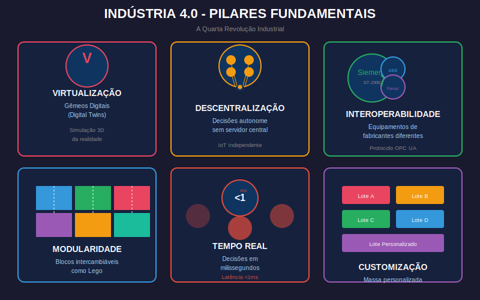
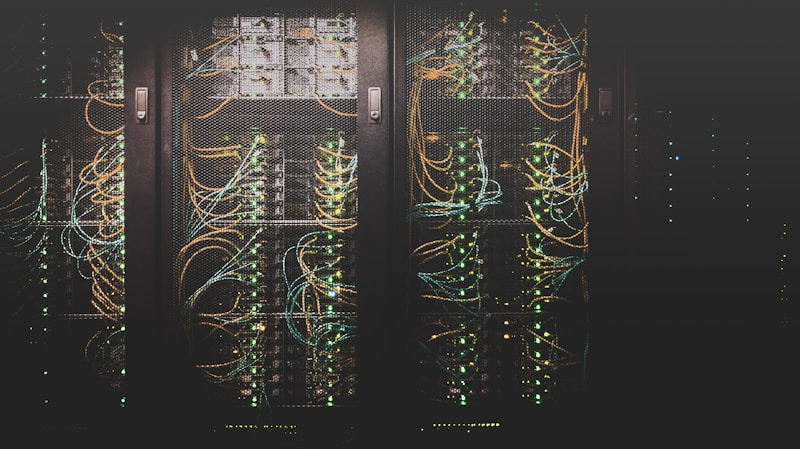
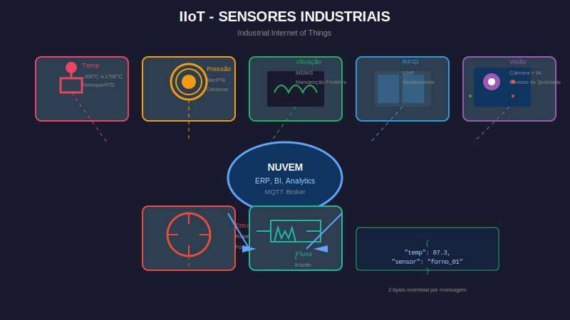
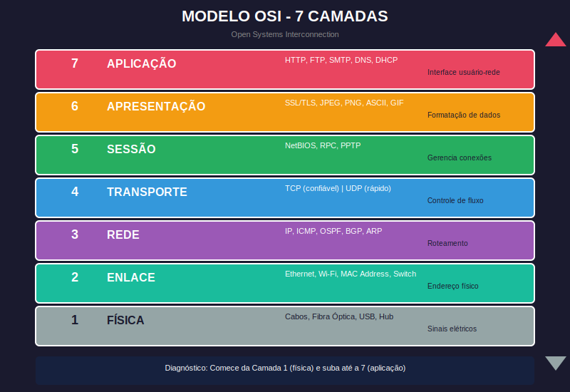

# 🌐 FUTEC 2: A Matriz Conectada, O TCP/IP e a Indústria 4.0

> **Carga Horária Estimada:** 16 Horas
> **Foco:** Indústria 4.0, Roteamento de Redes (Ping/Tracert), Cibersegurança Forense, Manipulação DOM via Inspecionar Elemento.
> **Baseado nos Tópicos Oficiais do SENAI:** Tópico 7 e Tópico 8.

Se na Missão 1 a turma dominou o funcionamento interno de uma única máquina bloqueada no tempo, nesta missão nós arrebentamos as portas do isolamento e abraçamos a Teia. A genialidade moderna não reside na força do hardware isolado, mas no "Efeito Rede", que orquestra e manipula milhões de dados através de cabos transoceânicos.

A hiperconectividade somada a robótica gerou uma nova revolução corporativa: **A Indústria 4.0**. Este material guiará os alunos pelas rodovias da internet com dinâmicas de engenharia baseadas em Laboratório de Redes e de Defesa Cibernética.

---

## 🏭 CAPÍTULO 1: O Paradigma da Indústria 4.0 (Tópico 7)

Em 1980, um robô era programado uma única vez e soldava portas de forma linear (Terceira Revolução). Em 2024, a soldadora autônoma alemã detecta uma variação térmica de 3 graus na chapa de aço e corrige o torque em milissegundos calculando as previsões cruzadas do banco de dados na nuvem corporativa (Indústria 4.0).





### 1.1 Os Princípios Fundamentais (Leis Inquebráveis)
Os alicerces da 4ª Revolução não dependem de força bruta, mas inteligência matemática e rede:
*   **Virtualização e Gêmeos Digitais (Digital Twins):** Um erro em software de colheitadeira custa milhões. A resposta do Vale do Silício foi criar os "Digital Twins". Uma cópia perfeita simulada em 3D e código físico fica hospedada na nuvem. Os engenheiros injetam os defeitos de carga mecânica no Gêmeo. Se a simulação da colheitadeira pegar fogo na nuvem por causa do código novo, o sistema rejeita a instalação, preservando a vida dos funcionários no campo físico real.
*   **Descentralização:** Nas velhas usinas, tudo dependia do "Computador Chefe" (Centralizado). Na I4.0, um sensor periférico minúsculo tem o poder de autodesligamento, cortando as travas sozinho sem passar pela aprovação central caso sinta vibrações letais.
*   **Tomada de Decisão em Tempo Real e Latência:** A palavra-chave da evolução é **Latência**. Se a ordem que salva do incêndio da máquina na África demorar 100 milissegundos em tráfego de rede para chegar ao servidor no Japão, a explosão acontece antes. Sistemas não admitem defasagens. É ação simultânea.
*   **Modularidade e Customização em Massa:** Os blocos operacionais na matriz funcionam de forma "Lego". Se uma nova lei exige garrafas menores de vidro, os programadores substituem via script o módulo de calibração, acoplando um novo modelo algorítmico num segundo, permitindo fabricar lotes ultracustomizados de diferentes garrafas diariamente pelo mesmo custo padronizado da velha fábrica Henry Ford de cor única.
*   **Interoperabilidade:** O princípio Rei. Equipamentos de empresas rivais na Alemanha, robôs e sensores chineses com sistemas em português. Não há barreiras. A internet atua como linguagem franca (TCP/IP / OPC UA).
*   **Ampliação e Inter-relação (Servitização):** As indústrias aéreas como a Rolls-Royce e General Electric não fabricam um motor colossal e entregam para a Boeing para sempre. Elas dizem: "Nós daremos o motor a vocês e vocês nos pagam as horas de tempo voado." A Rolls-Royce monitora a performance mecânica, calor e ventoinhas a cada milissegundo de volta no solo a partir da central remota, avisando a Cia. Aérea a hora exata da troca via manutenção inteligente. O **Produto de engenharia pesada se metamorfoseou em um Serviço em Nuvem.**

---

### 1.2 IIoT: A Internet Industrial das Coisas

O **IIoT (Industrial Internet of Things)** é a espinha dorsal física da Indústria 4.0 — a camada de sensores e atuadores que conecta o mundo físico ao digital.

**O que são sensores industriais e como funcionam:**

| Tipo de Sensor | Grandeza Medida | Aplicação na Usina |
|---|---|---|
| **Termopar / RTD** | Temperatura (-200°C a +1.700°C) | Monitorar temperatura de fornos de fundição |
| **Encoder Rotativo** | Velocidade e posição angular | Controle de posição em robôs e tornos CNC |
| **Sensor de Pressão** | Pressão em bar/psi | Caldeiras, sistemas hidráulicos, pneumáticos |
| **Sensor de Vibração (MEMS)** | Aceleração e frequência | Detecção de desgaste em rolamentos (Manutenção Preditiva) |
| **RFID (UHF)** | Identificação por radiofrequência | Rastreamento de paletes e ativos no galpão |
| **Visão Computacional (Câmera + IA)** | Imagem e vídeo processados por rede neural | Inspeção de qualidade: detectar trincas em peças |
| **Medidor de Fluxo** | Vazão de líquidos e gases | Controle de consumo de combustível e fluidos |



**O Protocolo MQTT:** Sensores IIoT geralmente não falam TCP/IP "pesado" — eles usam o **MQTT (Message Queuing Telemetry Transport)**, um protocolo ultraleve criado para dispositivos com bateria e conexões instáveis. Um sensor de temperatura publica a leitura `{"temp": 87.3, "sensor": "forno_01"}` no servidor central (broker) a cada 5 segundos, consumindo apenas **2 bytes de overhead** por mensagem. O broker distribui os dados para todos os sistemas inscritos (ERP, Dashboard, Alarme).

**O Protocolo OPC UA:** Quando os sistemas precisam de mais do que dados brutos — precisam de contexto, segurança e estrutura semântica — o padrão é o **OPC UA (Open Platform Communications Unified Architecture)**. É o idioma universal entre PLCs, SCADA, ERPs e robôs de fabricantes diferentes. Um PLC Siemens S7-1500 consegue enviar dados diretamente a um servidor SAP via OPC UA, sem precisar de integradores humanos.

---

### 1.3 Edge Computing vs. Cloud Computing: Onde Processar os Dados?

A Indústria 4.0 gerou um dilema estratégico: enviar tudo para a nuvem ou processar localmente?

**O Problema da Latência:**
Uma esteira de inspeção de peças gera 500 frames por segundo de vídeo. Se cada frame for enviado à nuvem para análise, o round-trip (ida e volta) pela internet leva 80ms — tempo suficiente para **37 peças defeituosas passarem desapercebidas** antes da resposta chegar.

**Edge Computing — O Processamento na Borda:**
O **Edge Computing** instala um computador poderoso (Edge Node) **dentro da fábrica**, próximo às máquinas. O processamento de visão computacional, a detecção de anomalias e o controle de qualidade ocorrem localmente em **<1ms**. Apenas os resultados finais (peças aprovadas/reprovadas, métricas resumidas) são enviados à nuvem para análise histórica e relatórios de BI.

```
[Câmera HD] → [Edge Node Local: IA processa em <1ms] → [Decisão: APROVAR/REJEITAR] → [Nuvem: relatório diário]
```

**Fog Computing:** Camada intermediária entre Edge e Cloud — servidores regionais que agregam dados de múltiplos galpões antes de enviar à nuvem central. Reduz o volume de dados transferidos em até 90%.

**A Regra de Ouro:**
- **Decisões em tempo real** (controle de qualidade, segurança, CNC): **Edge Computing**
- **Análise histórica, BI, Machine Learning em escala**: **Cloud Computing**
- **Agregação regional de múltiplos sites**: **Fog Computing**

---

### 1.4 Digital Twins (Gêmeos Digitais) em Profundidade

O conceito de Digital Twin vai muito além de uma "simulação 3D". Na prática industrial, um Gêmeo Digital é uma **réplica computacional de estado contínuo** que recebe dados em tempo real do ativo físico e espelha seu comportamento:

**Níveis de Maturidade do Digital Twin:**

1.  **Nível 1 — Twin de Componente:** Replica um componente único (ex: o rolamento de uma turbina). Modela desgaste e fadiga com base na temperatura e RPM coletados via sensor.

2.  **Nível 2 — Twin de Ativo:** Replica uma máquina completa (ex: a turbina inteira). Integra dados de todos os componentes. Pode simular o comportamento sob diferentes condições operacionais antes de modificar a máquina física.

3.  **Nível 3 — Twin de Sistema:** Replica toda uma linha de produção. Permite simular o impacto de adicionar uma nova máquina, alterar a sequência de operações ou testar um novo produto — sem parar a produção real.

4.  **Nível 4 — Twin de Processo:** O mais avançado — replica o processo de negócio completo (supply chain, logística, finanças) em conjunto com a operação física.

**Caso Real:** A Siemens usa Digital Twins para certificar turbinas eólicas offshore. Antes de instalar fisicamente uma turbina no Mar do Norte (custo de €2 milhões por turbina), o twin digital simula 20 anos de operação com dados de ventos históricos, marés e ciclos térmicos. Falhas previstas pelo twin são corrigidas no design antes da fabricação — economizando dezenas de milhões por projeto.

---

## 🌍 CAPÍTULO 2: A Física Lógica das Redes Globais (Tópico 8)

Para interligar bilhões de dispositivos, os governos criaram a arquitetura militar chamada ARPANET (ancestral da nossa Web), hoje o gigantesco protocolo **TCP/IP**.

### 2.1 Identidades Numéricas (IP e DNS)
Em redes, não existem nomes e rostos de fábricas. Existem identificadores.
*   **Endereço IPv4:** Todo notebook no galpão, impressora a laser e servidor possui uma "placa de automóvel" mundialmente conectada: O Internet Protocol (`192.168.0.25`).
*   **A "Telefonista" DNS:** Se o analista precisa acessar os relatórios da fábrica Scania em "scania.com", ele jamais vai digitar `152.199.19.161`. Ele digita a URL orgânica e o **DNS** (*Domain Name System*, o catálogo de endereços mestre da web) atua como tradutor, transformando o nome humano no endereço de IP do servidor no país onde está hospedado.

---

### 2.2 O Modelo OSI: As 7 Camadas da Comunicação

Para que dois computadores em países diferentes se comuniquem, a ISO padronizou 7 camadas de abstração — o **Modelo OSI (Open Systems Interconnection)**. Cada camada tem uma responsabilidade específica e se comunica apenas com as camadas adjacentes:



| Camada | Nome | Função | Exemplo Real |
|---|---|---|---|
| **7** | Aplicação | Interface direta com o usuário | HTTP, FTP, SMTP, DNS |
| **6** | Apresentação | Formatação, criptografia e compressão de dados | SSL/TLS, JPEG, ASCII |
| **5** | Sessão | Estabelece, mantém e encerra conexões | NetBIOS, RPC |
| **4** | Transporte | Controle de fluxo e confiabilidade | **TCP** (confiável) / **UDP** (veloz) |
| **3** | Rede | Endereçamento lógico e roteamento | **IP**, ICMP, OSPF |
| **2** | Enlace | Endereçamento físico e controle de acesso | Ethernet, Wi-Fi (MAC address) |
| **1** | Física | Transmissão de bits elétricos/ópticos | Cabos, fibra óptica, rádio |

**Por que o Analista de TI precisa dominar o OSI?**
Quando a internet da usina falha, o diagnóstico começa na Camada 1 e sobe:
- *"O cabo está conectado?"* → Camada 1
- *"O switch está reconhecendo a placa de rede?"* → Camada 2
- *"O IP está correto e há rota ao gateway?"* → Camada 3
- *"O firewall está bloqueando a porta TCP 443?"* → Camada 4
- *"O servidor DNS está respondendo?"* → Camada 7

**TCP vs UDP — A Decisão de Engenharia:**
*   **TCP (Transmission Control Protocol):** Confiável. Confirma o recebimento de cada pacote. Se um pacote for perdido, reenvia. Usado em: transferência de arquivos, e-mail, navegação web. O problema: adiciona latência (tempo de confirmação).
*   **UDP (User Datagram Protocol):** Sem confirmação — dispara pacotes e não verifica o recebimento. Usado em: streaming de vídeo, jogos online, VoIP, sistemas de controle industrial em tempo real. Um frame de vídeo perdido é menos crítico do que o atraso de pedir reenvio.

> **Na Indústria 4.0:** O protocolo MQTT usa TCP. Um sensor de temperatura que perde 1 leitura em 1.000 não causa dano — um delay de 50ms no controle de uma válvula pneumática pode causar explosão.

---

### 2.3 Subnetting e Endereçamento IPv4/IPv6

**Subnetting — Dividindo a Rede da Usina:**
Uma usina não coloca todos os dispositivos na mesma rede — isso seria um caos de broadcast e um pesadelo de segurança. O TI divide em **sub-redes (subnets)** usando a máscara de rede:

```
Rede da Usina: 192.168.0.0 /16  (65.536 endereços disponíveis)

Sub-rede Administração: 192.168.1.0 /24  (254 hosts — PCs do RH, Finanças)
Sub-rede Produção:      192.168.2.0 /24  (254 hosts — PLCs, robôs, CNCs)
Sub-rede TI/Servidores: 192.168.3.0 /24  (254 hosts — servidores, AD, backup)
Sub-rede Wi-Fi Visitas:  192.168.100.0 /24 (Isolada — sem acesso às outras redes)
```

A VLAN (Virtual Local Area Network) complementa o subnetting ao nível do switch — mesmo que dois computadores estejam no mesmo switch físico, VLANs diferentes os isolam completamente como se fossem redes físicas separadas.

**IPv6 — O Futuro Inevitável:**
O IPv4 possui ~4,3 bilhões de endereços possíveis — já esgotados globalmente desde 2011. O **IPv6** usa 128 bits ao invés de 32, gerando **340 undecilhões de endereços** (`2001:0db8:85a3:0000:0000:8a2e:0370:7334`). Cada sensor IIoT do planeta pode ter seu próprio endereço IP público único — viabilizando a escala real da Indústria 4.0 sem NAT.

---

### 2.4 Infraestrutura de Rede Industrial: Switches, Roteadores e Firewalls

**Switch Gerenciável vs. Não-Gerenciável:**
*   **Switch Simples (Não-Gerenciável):** Liga dispositivos em rede. Sem configuração. Adequado para pequenos escritórios. Vulnerável — qualquer dispositivo plugado entra na rede.
*   **Switch Gerenciável (Managed):** Permite configurar VLANs, Port Security (bloquear MAC addresses não autorizados), QoS (priorizar tráfego de vídeo sobre navegação), e gerar logs de tráfego. **Obrigatório em ambientes industriais.**

**Roteador vs. Firewall:**
*   **Roteador:** Decide o **caminho** que os pacotes percorrem entre redes diferentes. Opera na Camada 3 (Rede).
*   **Firewall:** Decide **o que pode ou não pode passar** entre redes. Opera da Camada 3 à 7. Um firewall de próxima geração (NGFW) inspeciona o conteúdo dos pacotes (Deep Packet Inspection), identifica aplicativos e bloqueia comportamentos suspeitos independente da porta utilizada.

**DMZ (Zona Desmilitarizada):** Segmento de rede intermediário entre a internet pública e a rede interna da empresa. Servidores web acessíveis externamente (portal do fornecedor, API de integração) ficam na DMZ — se um hacker comprometer o servidor web, ele estará preso na DMZ e não terá acesso à rede interna com os servidores de ERP e banco de dados.

---

### 👨‍🏫 ATIVIDADE DE LABORATÓRIO 1: Mapeamento de Rotas e Troubleshooting DNS
**Objetivo Tático:** Retirar do aluno a ilusão de que a Internet é algo "Mágico e Invisível", provando que a conexão é um sinal físico atravessando oceanos e roteadores mundiais mensuráveis pelo Terminal CMD.

**Passo a Passo em Sala de Aula:**
1.  **Auditoria Operacional do Sítio:** O aluno abre o **Prompt de Comando do Windows (`cmd`)**.
2.  **O Comando Tracert (Trace Route):** Explique ao aluno que a comunicação não vai direto de Sertãozinho ao Google. O pacote de dados "pula" (Hops) por roteadores em São Paulo, depois desce aos cabos submarinos do Atlântico até chegar aos DataCenters na Virgínia (EUA) e volta.
3.  Peça à turma que digite: `tracert www.google.com` (e apertem Enter).
4.  O quadro começará a despejar as Linhas de Salto (Hops). O professor demonstrará visualmente que a linha `1` é o Modem do roteador do próprio laboratório do SENAI, e as linhas de `7 a 11` são os relés das gigantes telecomunicações. É um momento de revelação espacial impressionante.
5.  **Configuração Corretiva de DNS:** Quando a internet da usina pisca, mas o Skype funciona e o site não, o servidor local da telefonia brasileira congelou a tabela DNS (Efeito "Apagão de Nomes").
6.  *Correção Física pela Turma:* Pressione `Win+R`, digite `ncpa.cpl` (Conexões de Rede). 
7.  Identifiquem a placa conectada (Wi-fi ou Ethernet). Botão direito > Propriedades.
8.  Encontrem e naveguem no item "*Protocolo IP Versão 4 (TCP/IPv4)*" dando dois cliques.
9.  Mandem os alunos alterarem do modo automático para **"Usar os seguintes endereços DNS"**. Eles inserirão o IP da gigante das nuvens do Google: `8.8.8.8` (primário) e `8.8.4.4` (secundário). O TI contornou e resolveu o apagão da operadora regional e reintegrou o chão de fábrica ao cérebro global da matriz num passe de mágica cibernética.

---

### 2.2 Anatomia Web: Hipertexto, Links e Manipulação de Tela
A tela do navegador é uma ilusão visual, não uma imagem fixa. O software de navegação baixa pacotes de texto da internet contendo "instruções" de pintura e os processa, utilizando:
*   **Hipertexto:** A capacidade revolucionária de pular de um documento gigantesco (como o Wikipedia) para um assunto correlato clicando em 1 única palavra azul encurtada (o Link de redirecionamento universal).
*   **Linguagem de Marcação e Estruturação (As Tags):** As famosas etiquetas HTML. Um botão verde num site governamental existe porque em sua constituição oculta foi ordenado: `<button style="background:green"> Pagar Multa </button>`.

---

### 👨‍🏫 ATIVIDADE DE LABORATÓRIO 2: A Mágica e o Perigo do Código Fonte (F12)
**Objetivo Tático:** Treinar a mentalidade do Desenvolvedor de Software ao desconstruir a aparência visual impenetrável de uma aplicação (Site) exposta ao cliente. Ensinar os perigos dos "Fake Prints Bancários".

**Passo a Passo em Sala de Aula:**
1.  **Abertura e Carga:** Os alunos abrem o **Google Chrome** no computador da sala e acessam um portal imenso de notícias reais da Internet (ex: g1.globo.com) ou portal local para manipulação inócua.
2.  **O Console do Desenvolvedor (DevTools):** Ordenem aos alunos que pressionem o Botão Divino da Arquitetura: a **Tecla F12**. (Ou botão direito > Inspecionar).
3.  O portal cibernético se dividirá. Uma metade é a página de notícias pública. A nova tela da direita exibirá o formigueiro assustador de programação HTML e CSS que dão sustentação ao código de construção do portal em tempo real na memória RAM do aluno.
4.  **A Ferramenta Mira (Select Element):** Peçam aos alunos que cliquem na minúscula seta que fica no canto extremo superior esquerdo desse novo painel (ou Ctrl+Shift+C). Em seguida, arrastem o cursor diretamente para cima da Manchete Principal vermelha que eles estão vendo na página normal, e cliquem.
5.  **Intervenção na RAM:** O painel F12, como rastreador térmico, iluminará em tons coloridos a exata linha de texto preta de HTML contendo o Título. 
6.  Os alunos devem clicar duas vezes em cima do texto da machete negra e substituírem todas as palavras digitando um texto arbitrário: `"A Turma do Senai Dominou as Ações na Bolsa Nacional"`. Ao apertar Enter, as letras da manchete do globo terrestre do jornal mudarão instantaneamente ao vivo aos olhos pasmados da classe.
7.  *Ancoragem de Moralidade:* O Professor pontua com clareza brutal: **Você não invadiu os DataCenters e invocou os servidores originais em Nova Iorque**. A alteração da injeção F12 altera perfeitamente apenas a Carga da Memória Temporária RAM em sua placa-mãe. Mas e se for uma página do Saldo de Conta da tela do Bradesco ou Nubank na web? Assim os alunos aprendem por engenharia analítica como fraudadores tiram "prints verdadeiros falsificados" para envio a extorsão em Whatsapp de empresas. Um técnico formado nunca mais confia cegamente em imagem printada.

---

## 🛡️ CAPÍTULO 3: Cibersegurança Forense e LGPD Legal

Ligar a indústria na Internet (O milagre da I4.0) é abrir os cofres milionários aos mercenários do Século 21. As empresas da atualidade investem dezenas de milhões de reais não em cercas elétricas nos muros, mas em Cibersegurança, pois as perdas de vazamentos resultam em prisões dos diretores e multas incalculáveis devido às rígidas normas de LGPD governamentais para proteção de arquivos biométricos e senhas massivas e CPF's de usuários expostos nos servidores centrais corporativos de Sertãozinho. 

*   **Malwares Parasitários (Worms / Vírus):** Enquanto o Vírus clássico é covarde e exige que um amador clique desesperadamente no anexo falso no Outlook com título `FOTOS_DO_AUMENTO_SALARIAL_24.exe`, infectando e desativando firewalls para apagar discos, os Worms (vermes cibernéticos) viajam silenciosamente entre cabos transoceânicos explorando vulnerabilidades das janelas e pulando sem aprovação do usuário de rede para rede local até esgotarem a memória e derrubarem subestações de eletricidade de países rivais.
*   **O Maior Câncer da Usina (Ransomware):** O arquétipo do terror cibernético. Quando essa forma brutal de malware se implanta, ele gera bilhões de cálculos encriptando pesadamente tudo que está escrito em relatórios da engenharia com chaves de fechaduras impossíveis de decodificar num trilhão de anos matemáticos. A empresa fica preta, congelada sem acesso a nenhum histórico e sem relatórios de contabilidade. Surge a temida caixa cinza na tela estipulando um prazo e relógio contagem regressiva, exigindo uma mala invisível gigantesca e milionária depositada sob os rastros e anonimatos da criptomoeda digital "Bitcoin" (sem fiscalização governamental). A defesa primária é ter **backups diários isolados na nuvem**.

---

### 3.2 Taxonomia Completa dos Ataques Cibernéticos

O profissional de TI precisa nomear e classificar as ameaças com precisão cirúrgica:

| Categoria | Tipo de Ataque | Mecanismo | Como se Defender |
|---|---|---|---|
| **Malware** | Vírus | Infecta arquivos executáveis | Antivírus atualizado, não executar arquivos desconhecidos |
| **Malware** | Worm | Auto-propaga pela rede | Firewall segmentado, patches atualizados |
| **Malware** | Trojan | Disfarça-se de software legítimo | Repositórios oficiais, hash verification |
| **Malware** | Spyware | Monitora atividades do usuário | EDR (Endpoint Detection & Response) |
| **Malware** | Ransomware | Criptografa dados e exige resgate | Backup 3-2-1, segmentação de rede |
| **Rede** | DDoS | Inunda servidor com requisições falsas | CDN, Cloudflare, rate limiting |
| **Rede** | Man in the Middle | Intercepta comunicação entre dois pontos | HTTPS/TLS, VPN corporativa |
| **Rede** | SQL Injection | Injeta código SQL em formulários web | Prepared statements, WAF |
| **Humano** | Phishing | E-mail falso que rouba credenciais | Treinamento de usuários, MFA |
| **Humano** | Engenharia Social | Manipulação psicológica do usuário | Cultura de segurança, protocolos de verificação |
| **Físico** | USB Drop | Pen-drive infectado abandonado na empresa | Política de bloqueio de USB, conscientização |

**O Ataque Stuxnet — Quando a Guerra Cibernética Destruiu Hardware Físico:**
Em 2010, um vírus chamado **Stuxnet** destruiu fisicamente mais de 1.000 centrífugas de enriquecimento de urânio no Irã — sem que um único soldado cruzasse a fronteira. O malware infectou os PLCs Siemens que controlavam as centrífugas, forçando-as a operar em velocidades destrutivas enquanto reportava ao operador que tudo estava normal. Foi o primeiro ataque cibernético que causou dano físico real à infraestrutura crítica de um Estado. A Indústria 4.0 e a Cibersegurança são, portanto, inseparáveis.

---

### 3.3 LGPD: A Lei Geral de Proteção de Dados

A **LGPD (Lei nº 13.709/2018)** é o escudo legal dos cidadãos brasileiros contra o uso indevido de seus dados. Para o TI da usina, não é opcional — é **obrigação legal com multas de até R$ 50 milhões por infração**.

**Dados Pessoais Protegidos:**
- Dados comuns: nome, e-mail, CPF, endereço, telefone, data de nascimento
- Dados sensíveis (proteção redobrada): biometria, dados de saúde, orientação sexual, dados genéticos, filiação religiosa e política

**Princípios Fundamentais da LGPD que o TI deve Implementar:**

| Princípio | Obrigação Prática para o TI |
|---|---|
| **Finalidade** | Usar dados apenas para o propósito declarado ao titular |
| **Necessidade** | Coletar apenas o mínimo necessário (data minimization) |
| **Transparência** | Informar ao usuário quais dados são coletados e por quê |
| **Segurança** | Implementar criptografia, controle de acesso e auditoria |
| **Responsabilização** | Manter registros de processamento de dados (ROPA) |

**Papel do DPO (Data Protection Officer — Encarregado de Dados):** Toda empresa que processa dados em larga escala deve nomear um DPO — profissional responsável por garantir conformidade com a LGPD, receber denúncias de titulares e comunicar incidentes à ANPD (Autoridade Nacional de Proteção de Dados) em até **72 horas** após a descoberta de um vazamento.

> **Consequência Real:** Em 2021, o Serasa Experian sofreu multa da ANPD por vender dados de 223 milhões de brasileiros sem consentimento. A LGPD transformou a proteção de dados de questão técnica em questão de compliance corporativo e responsabilidade criminal.

---

### 3.4 Criptografia, MFA e Política de Backup 3-2-1

**Criptografia — A Ciência de Tornar Dados Ilegíveis:**

*   **Criptografia Simétrica (AES):** Uma única chave serve para criptografar e descriptografar. O AES-256 (usado pelo governo americano para documentos top secret) levaria mais tempo para ser quebrado por força bruta do que a idade do universo. Problema: como enviar a chave com segurança para o destinatário?

*   **Criptografia Assimétrica (RSA / Curva Elíptica):** Usa um par de chaves — **chave pública** (compartilhada com todos) e **chave privada** (secreta). Uma mensagem criptografada com a chave pública só pode ser descriptografada com a chave privada correspondente. É o mecanismo por trás do HTTPS — o site envia sua chave pública, o navegador usa para criptografar a sessão, o servidor usa a privada para decifrar.

**MFA (Multi-Factor Authentication — Autenticação Multifator):**
Uma senha sozinha não é suficiente — pode ser roubada, adivinhada ou capturada via phishing. O MFA exige pelo menos dois fatores de diferentes categorias:
*   **Algo que você sabe:** Senha ou PIN
*   **Algo que você tem:** Token físico, aplicativo autenticador (Google Authenticator, Microsoft Authenticator), SMS
*   **Algo que você é:** Biometria (impressão digital, reconhecimento facial)

> **Estatística devastadora:** 99,9% dos ataques de comprometimento de contas são bloqueados simplesmente habilitando MFA — Microsoft, 2019.

**A Regra de Backup 3-2-1 (Obrigatório em Toda Infraestrutura Crítica):**
*   **3** cópias dos dados (original + 2 backups)
*   **2** mídias diferentes (ex: servidor local + nuvem)
*   **1** cópia offsite/offline (fisicamente separada da rede — imune a ransomware)

Uma usina que segue a regra 3-2-1 consegue se recuperar de um ataque de ransomware em horas, sem pagar resgate, simplesmente restaurando o backup offline. Uma usina sem backup estruturado pode levar semanas ou meses para se recuperar — ou nunca.

---

### 👨‍🏫 ATIVIDADE DE LABORATÓRIO 3: Verificação de Certificados e Defesa SSL
**Objetivo Tático:** Formar o olho de falcão crítico. Na defesa cibernética primária (Evitar que dados saiam interceptados num Wi-fi ou *Man in The Middle*), os alunos devem dissecar e conferir a Assinatura SSL das empresas na barra URL perigosa dos sites na prática em tempo real, sem supor inocência de páginas coloridas. O direito digital dita "Uso responsável" de imagem, evitando ataques da engenharia social cibernética da rede empresarial.

**Passo a Passo em Sala de Aula:**
1.  **Encontrando o Cadeado:** O estudante abre a página de Banco Oficial do Itaú, CAIXA ou Bradesco no Google Chrome das máquinas da escola. Eles focalizam a sua atenção analítica visual apenas para a extremidade esquerda no alto da Barra de Endereços (`URL`). Lá reside o **Ícone de Segurança do Cadeado Fechado e Seguro**. Isso aponta a transição mística dos protocolos HTTP clássicos e sem verificação de segurança, mudando inteiramente e criptografando o acesso à comunicação em túneis sob tecnologia **`HTTPS` (Hyper Text Transfer Protocol Secure)** onde ninguém vê a chave secreta e as senhas atravessarem.
2.  **Dissecando o Selo Corporativo:** Ao clicarem estritamente com o mouse no Cadeado, descem para **A Conexão é Segura**, e no próximo desdobramento subjacente e avançado entram no aviso validador e fundamental da segurança: **O certificado digital da conexão é inteiramente Válido e Operacional**.
3.  **Auditoria Máxima de Entidade Exposta:** Mas isso engana os hackers? Eles forjam selos de HTTPS grátis em lojas falsas de caldeiraria e boletos de propinas gigantescas corporativas. Peça agora aos alunos para observarem a extrema Linha Analítica de Validação de Domínio de Firma Empresarial Original na janela branca de segurança criptografada e expandida, localizada nos dizeres absolutos oficiais de registro: `"Emitido e Verificado diretamente para CNPJ da empresa Banco Central..."`. 
Se por uma catástrofe catastrófica e aterradora, a máquina estiver na tela idêntica e clonada em tudo na coloração laranja com letras do banco Itaú, mas na caixa do Cripto-Cadeado do painel apontar, silenciosamente no lado escuro como: *Emitido Exclusivamente ao domínio registrado da Indonésia ou à Fábrica na Rússia*, o aluno treinado não toca em mouse, levanta o dedo na aula e ativa com orgulho o Protocolo Máximo Anti-Ameaças, mandando abortar imediatamente a transferência e salvar sua máquina do ataque clássico de disfarce *Phishing e Engenharia Social avançada governamental* de espionagem tecnológica corporativa mundial baseada e ancorada nos princípios de guerra B2B. A corporação SENAI atesta sua prontidão cirúrgica completa para dominar sistemas de forma madura.

---

## ⚔️ PROVA FINAL: O Defensor da Matriz

Prove que você domina as redes globais e os preceitos industriais avançados:

---

**Questão 1:**
O presidente exige que a TI migre todos os servidores físicos do porão da usina (sujeito a alagamentos e calor) para uma infraestrutura remota descentralizada nos EUA. Essa decisão faz uso de qual Tecnologia Habilitadora da Indústria 4.0?

1.  A) Usabilidade e Cibersegurança local.
2.  B) Tags HTML de Redirecionamento de Rede.
3.  C) Computação em Nuvem (Cloud Computing).
4.  D) Virtualização local de Gêmeos Digitais on-premise.

<details>
<summary>👀 Ver Resposta e Explicação</summary>

**Resposta:** C) Computação em Nuvem (Cloud Computing).
**Por que?** A Computação em Nuvem terceiriza o peso físico de processamento e armazenamento para datacenters globais (Amazon AWS, Google Cloud, Azure) — eliminando riscos físicos locais e garantindo acesso contínuo de qualquer lugar do mundo.
</details>

---

**Questão 2:**
Todos os computadores da diretoria exibiram uma tela vermelha bloqueada exigindo pagamento em Bitcoin para desbloquear arquivos criptografados da empresa. Frente a qual modalidade específica de Malware (Tópico 8) a usina está?

1.  A) Ransomware (Sequestrador de Dados).
2.  B) Um Firewall descalibrado gerando falso positivo.
3.  C) Um Worm focado em consumo de largura de banda.
4.  D) Interoperabilidade reversa de protocolos OPC-UA.

<details>
<summary>👀 Ver Resposta e Explicação</summary>

**Resposta:** A) Ransomware (Sequestrador de Dados).
**Por que?** O Ransomware usa criptografia inquebrável para bloquear arquivos e exige resgate financeiro anônimo (geralmente em criptomoeda). A defesa primária é ter backups diários isolados na nuvem, garantindo a restauração sem pagar o resgate.
</details>

---

**Questão 3:**
A filial A comprou robôs da KUKA (Alemanha) e a filial B comprou robôs da Yaskawa (Japão). O presidente exige que ambas as máquinas se comuniquem com o mesmo ERP sem intervenção de programadores tradutores. Qual Princípio fundamental da Indústria 4.0 está sendo aplicado?

1.  A) Customização em Massa via Modularidade.
2.  B) Descentralização de Dados via Edge Computing.
3.  C) Interoperabilidade (Língua Universal entre Sistemas).
4.  D) Virtualização por Gêmeo Digital.

<details>
<summary>👀 Ver Resposta e Explicação</summary>

**Resposta:** C) Interoperabilidade (Língua Universal entre Sistemas).
**Por que?** Interoperabilidade é a capacidade de sistemas, equipamentos e marcas distintas trocarem dados de forma transparente usando protocolos universais (como OPC UA ou MQTT), quebrando as barreiras proprietárias entre fornecedores rivais.
</details>

---

*Parabéns. A Teia Global foi decifrada. Prossiga para a Missão 3: O Arsenal de Produtividade Corporativa.*
